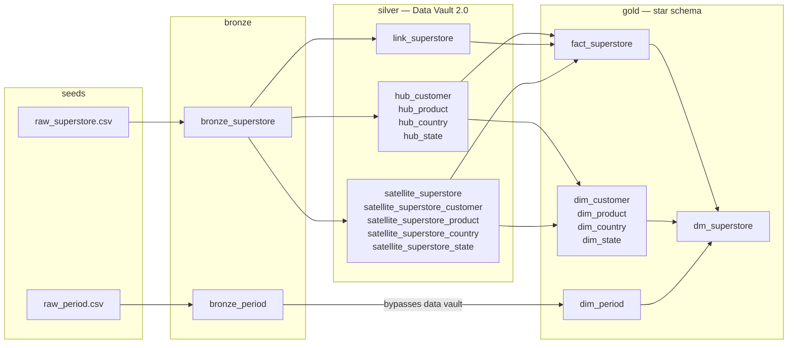

# Superstore Data Vault 2.0

A three-layer medallion warehouse for Superstore dataset, built with
**dbt-core** on **PostgreSQL**. Raw CSV lands in bronze, is modelled as
Data Vault 2.0 in silver, and is served as star schema in gold.

Every hub, link and satellite in the silver layer is generated by one of four
macros, so adding a vault table is a single call rather than another
hand-written load.

---

## What a Data Vault 2.0 is

Data Vault 2.0 splits a table into three kinds of thing, according to how fast
each one changes:

| | Holds | Changes |
|---|---|---|
| **Hub** | a business key, and nothing else | almost never — a customer ID is a customer ID forever |
| **Link** | the fact that some keys occurred together | append-only — a new combination is a new row |
| **Satellite** | the descriptive attributes hanging off a hub or a link | constantly — names, prices and addresses are rewritten upstream |

---

## Architecture



Full lineage with row counts, the vault ERD and the star schema are in
[docs/architecture.md](docs/architecture.md).

---

## Layers

### Bronze — `models/bronze/`

Typed, trimmed mirrors of the seeds. Nothing is filtered or reshaped. Seeds
land as text on purpose so that a malformed value fails inside a model that has
a diff and tests, rather than inside `dbt seed`.

| Model | Grain |
|---|---|
| `bronze_superstore` | one row per source `row_id` |
| `bronze_period` | one row per calendar date |

### Silver — `models/silver/`

Data Vault 2.0, materialized `incremental`. Hubs and links are pure inserts.
Satellite data is too -- a changed attribute is a new row, never a rewrite --
but two bookkeeping flags on each satellite row, `meta_is_active` and
`is_deleted`, are kept current by post-hooks that run after every load. A
re-run with nothing new upstream still leaves both untouched.

| Structure | Models | Key |
|---|---|---|
| Hubs | `hub_customer`, `hub_product`, `hub_country`, `hub_state` | `md5(business_key)` |
| Link | `link_superstore` | `md5(customer_id + country_code + state_code + product_id)` |
| Satellites | `satellite_superstore` (plus `_customer`, `_product`, `_country`, `_state`) | parent hash + `md5_diff` |

### Gold — `models/gold/`

Star schema, rebuilt as tables on every run. `fact_superstore` is projected
entirely from the vault — satellite to link to hubs — and never re-reads
bronze. That is the payoff for building the vault first.

---

## The four macros

Everything in silver and gold is generated by these. Adding a hub is one call;
changing the hash algorithm is one edit.

| Macro | Builds | What it does |
|---|---|---|
| `dv_hub()` | 4 hubs | de-duplicate a business key, hash it, insert what is new |
| `dv_link()` | 1 link | hash the key combination and re-derive each hub's hash |
| `dv_satellite()` | 5 satellites | hash the payload into `md5_diff`, append on change |
| `dv_dimension()` | 4 dimensions | join a hub to its live satellite row |

Supported by `dv_hash()` / `dv_clean()` / `dv_load_timestamp()` (the hashing
primitives) and `dv_satellite_current()` (the live-row window).

---

## Running it

Credentials live in `.env`. Copy the template and edit if the defaults do not
suit you; `.env` is gitignored, `.env.example` is the version that ships.

```bash
cp .env.example .env

docker compose up -d --build

docker compose exec dbt dbt deps
docker compose exec dbt dbt seed
docker compose exec dbt dbt build
```

Inspect the result:

```bash
docker compose exec postgres psql -U dbt -d warehouse -c \
  "select region, round(sum(sales),2) sales, round(sum(profit),2) profit
     from gold.dm_superstore group by region order by sales desc;"
```

Re-running `dbt build` is safe: silver models append only what is new, gold
models rebuild.

### Running part of it

`dbt build` runs models and tests together. To run models on their own, or to
work on one layer without rebuilding everything:

```bash
docker compose exec dbt dbt run
docker compose exec dbt dbt test

docker compose exec dbt dbt run --select bronze
docker compose exec dbt dbt run --select silver
docker compose exec dbt dbt run --select gold
```

Silver is incremental, so `dbt run` there appends rather than rebuilds. Renaming
or dropping a satellite column needs a full refresh, otherwise the old column is
left behind and every row looks new:

```bash
docker compose exec dbt dbt run --full-refresh --select silver
```

### dbt docs, as an alternative

[docs/architecture.md](docs/architecture.md) is written by hand and explains
*why* the warehouse is shaped the way it is -- the reasoning behind the grain
choices, the trade-offs, what would break if they changed.

dbt's built-in docs site answers a different question: *what is there right
now*. Generated from the project, so it cannot drift from the code -- an
interactive lineage graph, every model's compiled SQL, and the descriptions
from the `_*__models.yml` files.

```bash
docker compose exec dbt dbt docs generate
docker compose exec -d dbt dbt docs serve --host 0.0.0.0 --port 8080 --no-browser
```

Then open <http://localhost:8080>. The `--host 0.0.0.0` is required: dbt binds
to loopback by default, which inside a container is unreachable from your
machine. Stop the server with `docker compose restart dbt`.

Use the hand-written docs to understand the design, and `dbt docs` to explore
the build as it stands.

---

## Tests

`dbt build` runs them inline. Beyond the usual `unique` / `not_null` /
`relationships` coverage in the `_*__models.yml` files:

| Test | What it protects |
|---|---|
| `assert_fact_reconciles_to_bronze` | row count and `sales` / `quantity` / `profit` totals survive the vault intact |
| `assert_mart_reconciles_to_fact` | no dimension join in `dm_superstore` multiplies rows |
| `assert_satellite_has_one_active_version` | `dv_satellite_current()` really does return one live row per grain |
| `assert_is_deleted_matches_source` | `is_deleted` still agrees with a fresh read of bronze for every satellite |

The reconciliation tests are the ones that matter. A fan-out in a link or a
collapsed multi-active satellite is invisible in row-level tests and obvious in
a total.

---

## Layout

```
├── seeds/                # data source CSVs + seed schema
├── models/
│   ├── bronze/           # typed mirrors of the seeds
│   ├── silver/
│   │   ├── hubs/         # 4 models, 1 macro call each
│   │   ├── links/        # 1 model
│   │   └── satellites/   # 5 models
│   └── gold/             # 5 dims, 1 fact, 1 flat mart
├── macros/
│   ├── datavault/        # dv_hash, dv_hub, dv_link, dv_satellite, dv_dimension
│   └── utils/            # schema naming
├── tests/                # reconciliation tests
└── docs/                 # architecture diagrams
```
