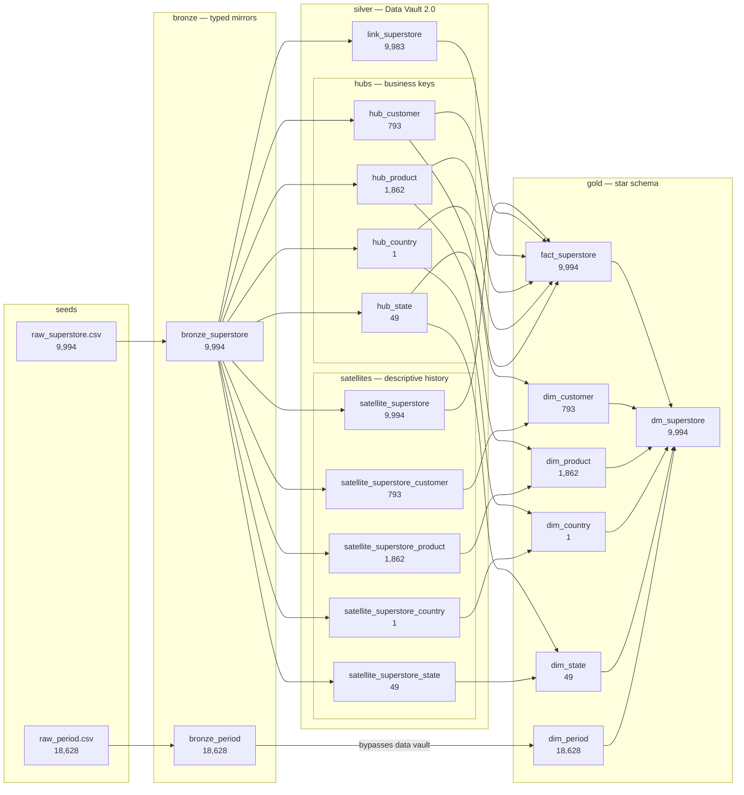
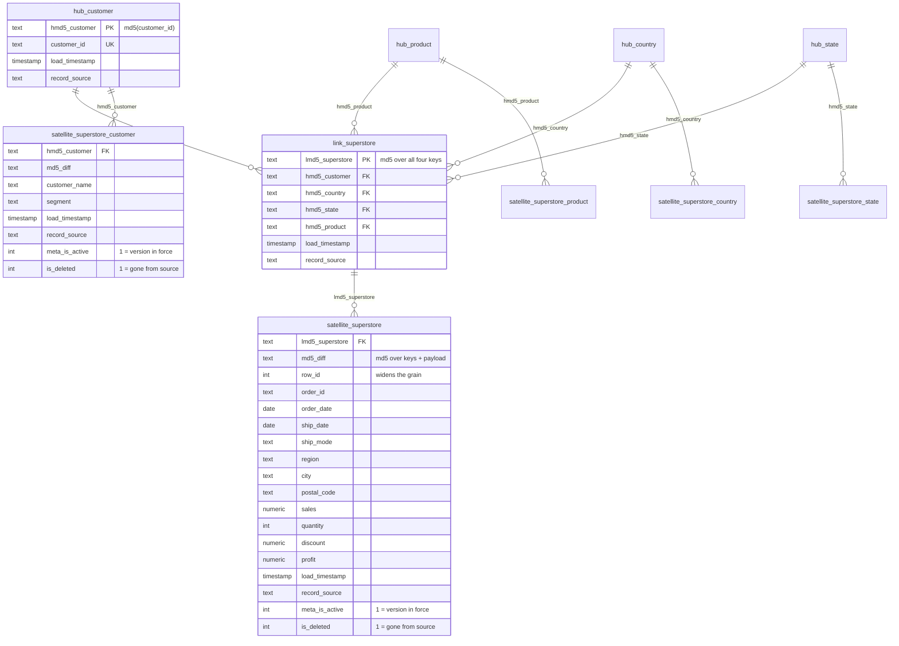
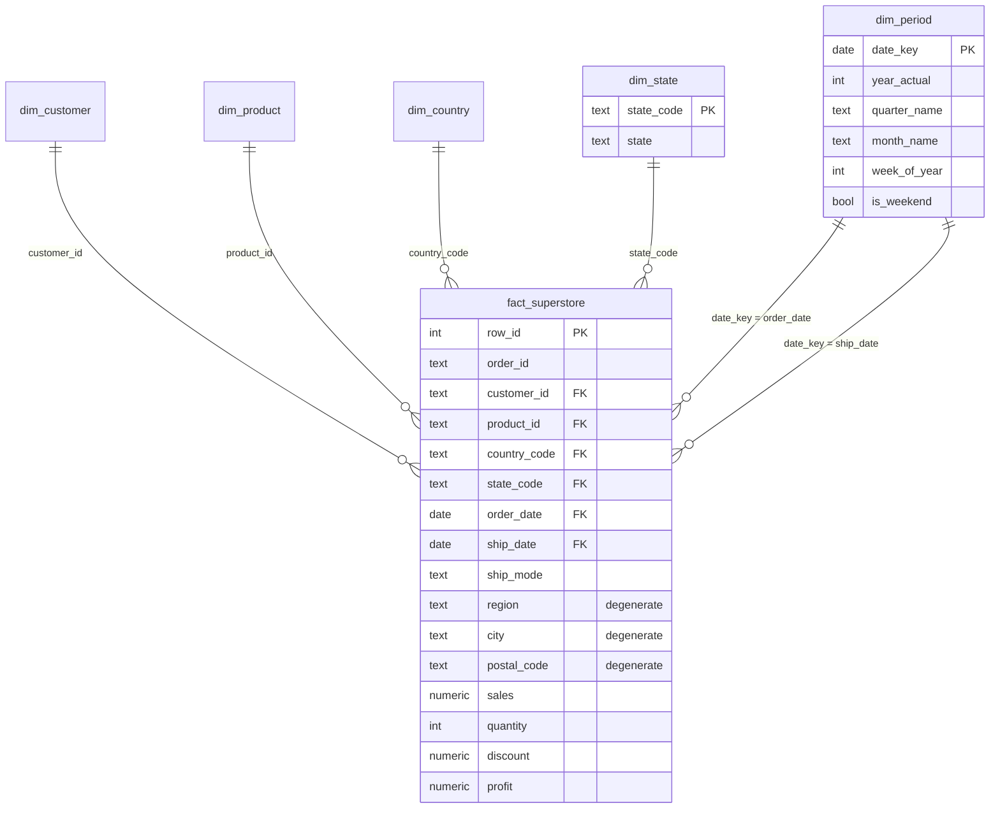
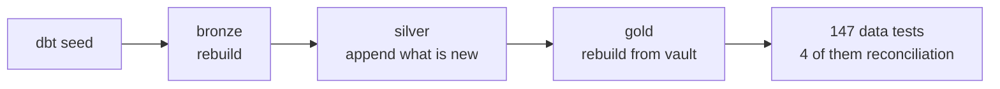

# Architecture

How a row travels from CSV to a queryable star schema, and why it takes the
route it does. For the concepts behind the middle layer, see
[What a Data Vault 2.0 is](../README.md#what-a-data-vault-20-is).

---

## 1. End-to-end lineage

Every model in the project, with the row count each one holds after a full
build.

Three things worth reading off that graph:

- **Everything in silver depends only on `bronze_superstore`.** No vault model
  reads another vault model. Because the keys are MD5 hashes of the business
  key rather than assigned sequences, nothing has to be loaded before anything
  else — dbt builds all ten in parallel.
- **`fact_superstore` has no edge back to bronze.** It is projected entirely
  from the vault. That is the test of whether the vault is actually load-bearing
  or just decoration.
- **`bronze_period` goes straight to gold.** A calendar has no mutable business
  key and no history, so a hub and satellite would add two tables and reproduce
  the seed exactly.

---

## 2. The vault

Hubs hold keys, the link holds the relationship between them, satellites hold
everything descriptive. Joins are on MD5 hashes throughout.

### Why the link has fewer rows than the satellite

`link_superstore` holds 9,983 rows against `satellite_superstore`'s 9,994.
`lmd5_superstore` hashes customer + country + state + product, so one link key
covers every order line that customer ever placed for that product — and in
this dataset **11 links carry more than one line**.

That is why `row_id` is declared as a `child_key` on the transaction satellite,
making it explicitly multi-active. Without it, taking "the current row per link
key" would silently drop those 11 order lines and every total in gold would be
short.

---

## 3. The star schema

The vault flattened back into something an analyst can query. Grain of both
`fact_superstore` and `dm_superstore` is one row per order line.

### Why the dimensions are one row per key

Every dimension here publishes only attributes its business key determines --
`state_code -> state` is 1:1 across all 49 codes, so `dim_state` is 49 rows.
That is what lets a fact join it on the key alone without multiplying.

`assert_mart_reconciles_to_fact` is what keeps this honest — it fails the
moment a dimension join multiplies a row.

---

## 4. Load behaviour per layer

| Layer | Materialization | On re-run |
|---|---|---|
| bronze | `table` | rebuilt from the seed |
| silver | `incremental` | appends only the keys and versions not already loaded |
| gold | `table` | rebuilt from the vault |

A second `dbt build` is a no-op against silver: all ten vault models report the
same row counts, because every hub anti-joins on its hash key and every
satellite anti-joins on `(parent_hash, md5_diff)`.

Satellites also carry `meta_is_active` -- 1 for the version in force, 0 once
superseded. It is stored rather than derived, and the `dv_deactivate_superseded()`
post-hook demotes whatever each load supersedes, so the flag cannot go stale.
`assert_satellite_has_one_active_version` checks all five satellites hold
exactly one active row per grain.

An insert-only load only ever sees new data, so nothing so far records a
business key vanishing from the source. `is_deleted` closes that gap: the
`dv_track_deletions()` post-hook compares each satellite's active grains
against a fresh read of its source and flags whatever is missing -- clearing
the flag again if the grain later reappears. `dv_satellite_current()` filters
it out, so a deleted row disappears from every gold model without a row ever
being removed. `assert_is_deleted_matches_source` re-derives the same
comparison independently and checks it still agrees.

The reconciliation tests are the ones that matter: row counts and
`sales` / `quantity` / `profit` totals must be identical in bronze,
`fact_superstore` and `dm_superstore`. A fan-out in the link or a collapsed
multi-active satellite is invisible to row-level tests and obvious in a total.
